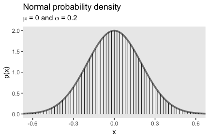
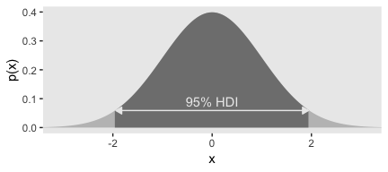
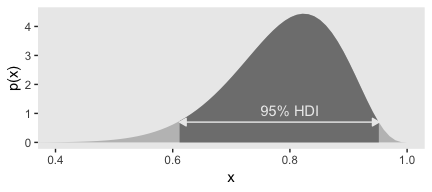
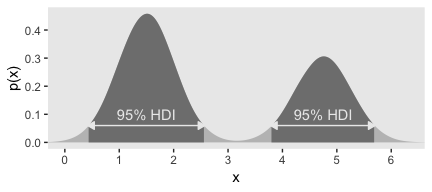

Chapter 04. What is This Stuff Called Probability?
================
A Solomon Kurz
2018-07-09

4.2. Probability: Outside or inside the head
--------------------------------------------

#### 4.2.1.1. Simulating a long-run relative frequency.

Figure 4.1.

``` r
library(tidyverse)

N       <- 500  # Specify the total number of flips, denoted N.
p_heads <- 0.5  # Specify underlying probability of heads.

# Flip a coin N times and compute the running proportion of heads at each flip. Generate a random sample of N flips (heads = 1, tails = 0):
set.seed(-1)
my_flip <-
  tibble(flip_sequence = sample(x = c(0, 1), 
                                prob = c(1 - p_heads, p_heads), 
                                size = N, 
                                replace = T),
         r = cumsum(flip_sequence),
         n = 1:N,
         run_prop = r/n)

end_prop <-
  my_flip %>% 
  select(run_prop) %>% 
  slice(n()) %>% 
  round(digits = 3) %>% 
  pull()

my_flip %>%
  filter(n < 1000) %>%  # This step cuts down on the time it takes to make the plot
  ggplot(aes(x = n, y = run_prop)) +
  geom_hline(yintercept = .5, color = "white") +
  geom_line(color = "grey50") +
  geom_point(color = "grey50", alpha = 1/4) +
  scale_x_log10(breaks = c(1, 2, 5, 10, 20, 50, 200, 500)) +
  coord_cartesian(xlim = 1:500,
                  ylim = 0:1) +
  labs(title = "Running proportion of heads",
       subtitle = paste("Our end proportion =", end_prop),
       x = "Flip number", 
       y = "Proportion of heads") +
  theme(panel.grid = element_blank())
```


### 4.3.1. Discrete distributions: Probability mass.

In order to recreate Figure 4.2, we need to generate the heights data. In his "HtWtDataDenerator" R script, Kruschke provided the code for a function that will generate height data of the kind in his text. Here is the code:

``` r
HtWtDataGenerator <- function(n_subj, rndsd = NULL, male_prob = 0.50) {
  # Random height, weight generator for males and females. Uses parameters from
  # Brainard, J. & Burmaster, D. E. (1992). Bivariate distributions for height and
  # weight of men and women in the United States. Risk Analysis, 12(2), 267-275.
  # Kruschke, J. K. (2011). Doing Bayesian data analysis:
  # A Tutorial with R and BUGS. Academic Press / Elsevier.
  # Kruschke, J. K. (2014). Doing Bayesian data analysis, 2nd Edition:
  # A Tutorial with R, JAGS and Stan. Academic Press / Elsevier.
  
  require(MASS)
  
  # Specify parameters of multivariate normal (MVN) distributions.
  # Men:
  HtMmu   <- 69.18
  HtMsd   <- 2.87
  lnWtMmu <- 5.14
  lnWtMsd <- 0.17
  Mrho    <- 0.42
  Mmean   <- c(HtMmu, lnWtMmu)
  Msigma  <- matrix(c(HtMsd^2, Mrho * HtMsd * lnWtMsd,
                      Mrho * HtMsd * lnWtMsd, lnWtMsd^2), nrow = 2)
  # Women cluster 1:
  HtFmu1   <- 63.11
  HtFsd1   <- 2.76
  lnWtFmu1 <- 5.06
  lnWtFsd1 <- 0.24
  Frho1    <- 0.41
  prop1    <- 0.46
  Fmean1   <- c(HtFmu1, lnWtFmu1)
  Fsigma1  <- matrix(c(HtFsd1^2, Frho1 * HtFsd1 * lnWtFsd1,
                       Frho1 * HtFsd1 * lnWtFsd1, lnWtFsd1^2), nrow = 2)
  # Women cluster 2:
  HtFmu2   <- 64.36
  HtFsd2   <- 2.49
  lnWtFmu2 <- 4.86
  lnWtFsd2 <- 0.14
  Frho2    <- 0.44
  prop2    <- 1 - prop1
  Fmean2   <- c(HtFmu2, lnWtFmu2)
  Fsigma2  <- matrix(c(HtFsd2^2, Frho2 * HtFsd2 * lnWtFsd2,
                       Frho2 * HtFsd2 * lnWtFsd2, lnWtFsd2^2), nrow = 2)
  
  # Randomly generate data values from those MVN distributions.
  if (!is.null(rndsd)) {set.seed(rndsd)}
  data_matrix <- matrix(0, nrow = n_subj, ncol = 3)
  colnames(data_matrix) <- c("male", "height", "weight")
  maleval <- 1; femaleval <- 0 # arbitrary coding values
  for (i in 1:n_subj) {
    # Flip coin to decide sex
    sex = sample(c(maleval, femaleval), size = 1, replace = TRUE,
                 prob = c(male_prob, 1 - male_prob))
    if (sex == maleval) {datum <- mvrnorm(n = 1, mu = Mmean, Sigma = Msigma)}
    if (sex == femaleval) {
      Fclust = sample(c(1, 2), size = 1, replace = TRUE, prob = c(prop1, prop2))
      if (Fclust == 1) {datum <- mvrnorm(n = 1, mu = Fmean1, Sigma = Fsigma1)}
      if (Fclust == 2) {datum <- mvrnorm(n = 1, mu = Fmean2, Sigma = Fsigma2)}
    }
    data_matrix[i, ] = c(sex, round(c(datum[1], exp(datum[2])), 1))
  }
  
  return(data_matrix)
} # end function
```

Now we have the `HtWtDataGenerator()` function, all we need to do is determine how many values are generated and how probable we want the values to be based on those from men. These are controlled by the `n_subj` and `male_prob` parameters.

``` r
set.seed(4.2)
d <-
  HtWtDataGenerator(n_subj = 10000, male_prob = .5) %>%
  as_tibble() %>%
  mutate(person = 1:n())

d %>%
  head()
```

    ## # A tibble: 6 x 4
    ##    male height weight person
    ##   <dbl>  <dbl>  <dbl>  <int>
    ## 1     1   76     222.      1
    ## 2     0   59.5   190       2
    ## 3     0   60.2   118.      3
    ## 4     1   64.1   138.      4
    ## 5     1   69.3   148.      5
    ## 6     1   69.1   166.      6

For Figure 4.2, we'll make extensive use of the `case_when()` syntax, which you can learn more about from [hrbrmstr's *Making a Case for case\_when*](https://rud.is/b/2017/03/10/making-a-case-for-case_when/).

``` r
d_bin_2 <-
  d %>%
  mutate(bin = case_when(
    height < 51 ~ 51,
    between(height, 51, 53) ~ 53,
    between(height, 53, 55) ~ 55,
    between(height, 55, 57) ~ 57,
    between(height, 57, 59) ~ 59,
    between(height, 59, 61) ~ 61,
    between(height, 61, 63) ~ 63,
    between(height, 63, 65) ~ 65,
    between(height, 65, 67) ~ 67,
    between(height, 67, 69) ~ 69,
    between(height, 69, 71) ~ 71,
    between(height, 71, 73) ~ 73,
    between(height, 73, 75) ~ 75,
    between(height, 75, 77) ~ 77,
    between(height, 77, 79) ~ 79,
    between(height, 79, 81) ~ 71,
    between(height, 81, 83) ~ 83,
    height > 83 ~ 85)
    ) %>%
  group_by(bin) %>%
  summarise(n = n()) %>%
  mutate(height = bin - 1)

d %>%
  ggplot(aes(x = height, y = person)) +
  geom_point(size = 3/4, color = "grey67", alpha = 1/2) +
  geom_vline(xintercept = seq(from = 51, to = 83, by = 2),
             linetype = 3, color = "grey33") +
  geom_text(data = d_bin_2, 
            aes(y = 5000, label = n),
            size = 3.25) +
  scale_y_continuous(breaks = c(0, 5000, 10000)) +
  labs(title = "Total N = 10,000",
       x = "Height (inches)",
       y = "Person #") +
  theme(panel.grid = element_blank())
```


Figure 4.2.b.

``` r
d %>%
  ggplot(aes(x = height)) +
  geom_histogram(aes(y = stat(density)),
                 binwidth = 2, fill = "grey67",
                 color = "grey92", size = 1/8) +
  scale_y_continuous(breaks = c(0, .04, .08)) +
  coord_cartesian(xlim = 51:83) +
  labs(x = "Height (inches)",
       y = "Probability density") +
  theme(panel.grid = element_blank())
```


Figure 4.2.c.

``` r
d_bin_2 <-
  d %>%
  mutate(bin = case_when(
    height < 51 ~ 51,
    between(height, 51, 52) ~ 52,
    between(height, 52, 53) ~ 53,
    between(height, 53, 54) ~ 54,
    between(height, 54, 55) ~ 55,
    between(height, 55, 56) ~ 56,
    between(height, 56, 57) ~ 57,
    between(height, 57, 58) ~ 58,
    between(height, 58, 59) ~ 59,
    between(height, 59, 60) ~ 60,
    between(height, 60, 61) ~ 61,
    between(height, 61, 62) ~ 62,
    between(height, 62, 63) ~ 63,
    between(height, 63, 64) ~ 64,
    between(height, 64, 65) ~ 65,
    between(height, 65, 66) ~ 66,
    between(height, 66, 67) ~ 67,
    between(height, 67, 68) ~ 68,
    between(height, 68, 69) ~ 69,
    between(height, 69, 70) ~ 70,
    between(height, 70, 71) ~ 71,
    between(height, 71, 72) ~ 72,
    between(height, 72, 73) ~ 73,
    between(height, 73, 74) ~ 74,
    between(height, 74, 75) ~ 75,
    between(height, 75, 76) ~ 76,
    between(height, 76, 77) ~ 77,
    between(height, 77, 78) ~ 78,
    between(height, 78, 79) ~ 79,
    between(height, 79, 80) ~ 80,
    between(height, 80, 81) ~ 81,
    between(height, 81, 82) ~ 82,
    between(height, 82, 83) ~ 83,
    between(height, 83, 84) ~ 84,
    height > 84 ~ 85)
    ) %>%
  group_by(bin) %>%
  summarise(n = n()) %>%
  mutate(height = bin - .5)

d %>%
  ggplot(aes(x = height, y = person)) +
  geom_point(size = 3/4, color = "grey67", alpha = 1/2) +
  geom_vline(xintercept = seq(from = 51, to = 83, by = 1),
             linetype = 3, color = "grey33") +
  geom_text(data = d_bin_2, 
            aes(y = 5000, label = n, angle = 90),
            size = 3.25) +
  scale_y_continuous(breaks = c(0, 5000, 10000)) +
  labs(title = "Total N = 10,000",
       x = "Height (inches)",
       y = "Person #") +
  theme(panel.grid = element_blank())
```


Figure 4.2.d.

``` r
d %>%
  ggplot(aes(x = height)) +
  geom_histogram(aes(y = stat(density)), boundary = 0,
                 binwidth = 1, fill = "grey67",
                 color = "grey92", size = 1/8) +
  scale_y_continuous(breaks = c(0, .04, .08)) +
  coord_cartesian(xlim = 51:83) +
  labs(x = "Height (inches)",
       y = "Probability density") +
  theme(panel.grid = element_blank())
```


### 4.3.2. Continuous distributions: Rendezvous with density.

``` r
set.seed(4.3)
d <-
  tibble(height = rnorm(1e4, mean = 84, sd = .1)) %>%
  mutate(door = 1:n())

d %>%
  head()
```

    ## # A tibble: 6 x 2
    ##   height  door
    ##    <dbl> <int>
    ## 1   84.0     1
    ## 2   83.9     2
    ## 3   84.1     3
    ## 4   84.1     4
    ## 5   84.2     5
    ## 6   84.1     6

Figure 4.3.a.

``` r
s <- seq(from = 83.6, to = 84.4, length.out = 31)

d_bin_3 <-
  d %>%
  mutate(bin = case_when(
    height < s[1] ~ 83.6,
    between(height, s[1],  s[2])  ~ s[2],
    between(height, s[2],  s[3])  ~ s[3],
    between(height, s[3],  s[4])  ~ s[4],
    between(height, s[4],  s[5])  ~ s[5],
    between(height, s[5],  s[6])  ~ s[6],
    between(height, s[6],  s[7])  ~ s[7],
    between(height, s[7],  s[8])  ~ s[8],
    between(height, s[8],  s[9])  ~ s[9],
    between(height, s[9],  s[10]) ~ s[10],
    between(height, s[10], s[11]) ~ s[11],
    between(height, s[11], s[12]) ~ s[12],
    between(height, s[12], s[13]) ~ s[13],
    between(height, s[13], s[14]) ~ s[14],
    between(height, s[14], s[15]) ~ s[15],
    between(height, s[15], s[16]) ~ s[16],
    between(height, s[16], s[17]) ~ s[17],
    between(height, s[17], s[18]) ~ s[18],
    between(height, s[18], s[19]) ~ s[19],
    between(height, s[19], s[20]) ~ s[20],
    between(height, s[20], s[21]) ~ s[21],
    between(height, s[21], s[22]) ~ s[22],
    between(height, s[22], s[23]) ~ s[23],
    between(height, s[23], s[24]) ~ s[24],
    between(height, s[24], s[25]) ~ s[25],
    between(height, s[25], s[26]) ~ s[26],
    between(height, s[26], s[27]) ~ s[27],
    between(height, s[27], s[28]) ~ s[28],
    between(height, s[28], s[29]) ~ s[29],
    between(height, s[29], s[30]) ~ s[30],
    between(height, s[30], s[31]) ~ s[31],
    height > s[31] ~ 84.4)
    ) %>%
  group_by(bin) %>%
  summarise(n = n()) %>%
  mutate(height = bin - (s[2] - s[1])/2)

d %>%
  ggplot(aes(x = height, y = door)) +
  geom_point(size = 3/4, color = "grey67", alpha = 1/2) +
  geom_vline(xintercept = seq(from = 83.6, to = 84.4, length.out = 31),
             linetype = 3, color = "grey33") +
  geom_text(data = d_bin_3,
            aes(y = 5000, label = n, angle = 90),
            size = 3.25) +
  scale_y_continuous(breaks = c(0, 5000, 10000)) +
  labs(title = "Total N = 10,000",
       x = "Height (inches)",
       y = "Door #") +
  theme(panel.grid = element_blank())
```


Figure 4.3.b.

``` r
d %>%
  ggplot(aes(x = height)) +
  geom_histogram(aes(y = stat(density)), boundary = 0,
                 binwidth = .025, fill = "grey67",
                 color = "grey92", size = 1/8) +
  scale_y_continuous(breaks = 0:4) +
  coord_cartesian(xlim = c(83.6, 84.4)) +
  labs(x = "Height (inches)",
       y = "Probability density") +
  theme(panel.grid = element_blank())
```


#### 4.3.2.2. The normal probability density function.

Figure 4.4.

``` r
ggplot(data = tibble(x = seq(from = -.8, to = .8, by = .01)),
       aes(x = x)) +
  geom_line(aes(y = dnorm(x, mean = 0, sd = .2)),
            color = "grey50", size = 1.25) +
  geom_linerange(data = tibble(x = seq(from = -.8, to = .8, by = .02)),
                 aes(ymin = 0, ymax = dnorm(x, 
                                            mean = 0, sd = .2)),
                 size = 1/3) +
  coord_cartesian(xlim = c(-.61, .61)) +
  labs(title = "Normal probability density",
       subtitle = expression(paste(mu, " = 0 and ", sigma, " = 0.2")),
       y = "p(x)") +
  theme(panel.grid = element_blank())
```



### 4.3.4. Highest density interval (HDI).

Figure 4.5.a.

``` r
ggplot(data = tibble(x = seq(from = -3.5, to = 3.5, by = .05)),
       aes(x = x)) +
  geom_ribbon(aes(ymin = 0,
                  ymax = dnorm(x, mean = 0, sd = 1)),
              fill = "grey75") +
  geom_ribbon(data = tibble(x = seq(from = -1.96, to = 1.96, by = .05)),
              aes(ymin = 0,
                  ymax = dnorm(x, mean = 0, sd = 1)),
              fill = "grey50") +
  geom_line(data = tibble(x = c(-1.94, 1.94),
                          y = c(.059, .059)),
            aes(x = x, y = y),
            arrow = arrow(length = unit(.2, "cm"), 
                          ends = "both", 
                          type = "closed"),
            color = "grey92") +
  annotate("text", x = 0, y = .09, 
           label = "95% HDI", color = "grey92") +
  coord_cartesian(xlim = c(-3.1, 3.1)) +
  labs(y = "p(x)") +
  theme(panel.grid = element_blank())
```



Figure 4.5.b.

``` r
library(HDInterval)

h <- hdi(tibble(x = rbeta(1e6, shape1 = 15, shape2 = 4))) %>%
  as.vector()

ggplot(data = tibble(x = seq(from = 0, to = 1, by = .01)),
       aes(x = x)) +
  geom_ribbon(aes(ymin = 0,
                  ymax = dbeta(x, shape1 = 15, shape2 = 4)),
              fill = "grey75") +
  geom_ribbon(data = tibble(x = seq(from = h[1], to = h[2], by = .01)),
              aes(ymin = 0,
                  ymax = dbeta(x, shape1 = 15, shape2 = 4)),
              fill = "grey50") +
  geom_line(data = tibble(x = h,
                          y = c(.7, .7)),
            aes(x = x, y = y),
            arrow = arrow(length = unit(.2, "cm"),
                          ends = "both",
                          type = "closed"),
            color = "grey92") +
  annotate("text", x = .8, y = 1.1, 
           label = "95% HDI", color = "grey92") +
  coord_cartesian(xlim = c(.4, 1)) +
  labs(y = "p(x)") +
  theme(panel.grid = element_blank())
```



Figure 4.5.c.

``` r
# Here we create the data from two Gaussians
set.seed(1.5)
d <-
  tibble(x = c(rnorm(6e4, mean = 1.5, sd = .5),
               rnorm(4e4, mean = 4.75, sd = .5)))

# Here we compute the HDIs. In order to accommodate the bimodal density, you need to use the allowSplit = T argument AND you need to nest the data argument within the density() function
h <-
  hdi(density(d$x), allowSplit = T) %>%
  as_tibble()

# In order to fill the bimodal density with the split HDIs, you need to use the density() function to transform the d data to a tibble with the values for the x-axis in an x vector and the corresponding density values in a y vector. 
dens <-
  d$x %>%
  density() %>%
  with(tibble(x, y))
  
# This is a monster
ggplot(data = dens,
         aes(x = x, y = y)) +
  geom_ribbon(aes(ymin = 0, ymax = y),
              size = 0, fill = "grey75") +
  # Note the use of pull(), which extracts the values, rather than return a tibble  
  geom_ribbon(data = dens %>% filter(x > h[1,1] %>% pull() & 
                                       x < h[1,2] %>% pull()),
              aes(ymin = 0, ymax = y),
              size = 0, fill = "grey50") +
  geom_ribbon(data = dens %>% filter(x > h[2,1] %>% pull() & 
                                       x < h[2,2] %>% pull()),
              aes(ymin = 0, ymax = y),
              size = 0, fill = "grey50") +
  geom_line(data = tibble(x = c(h[1,1] %>% pull(), h[1,2] %>% pull()),
                          y = c(.06, .06)),
            aes(x = x, y = y),
            arrow = arrow(length = unit(.2,"cm"),
                          ends = "both",
                          type = "closed"),
            color = "grey92") +
  geom_line(data = tibble(x = c(h[2,1] %>% pull(), h[2,2] %>% pull()),
                          y = c(.06, .06)),
            aes(x = x, y = y),
            arrow = arrow(length = unit(.2,"cm"),
                          ends = "both",
                          type = "closed"),
            color = "grey92") +
  annotate("text", x = 1.5, y = .1, 
           label = "95% HDI", color = "grey92") +
  annotate("text", x = 4.75, y = .1, 
           label = "95% HDI", color = "grey92") +
  scale_x_continuous(breaks = 0:6) +
  scale_y_continuous(breaks = c(0, .1, .2, .3, .4, .5)) +
  coord_cartesian(xlim = c(0, 6.3)) +
  labs(y = "p(x)") +
  theme(panel.grid = element_blank())
```



References
----------

Kruschke, J. K. (2015). *Doing Bayesian data analysis, Second Edition: A tutorial with R, JAGS, and Stan.* Burlington, MA: Academic Press/Elsevier.

``` r
sessionInfo()
```

    ## R version 3.5.1 (2018-07-02)
    ## Platform: x86_64-apple-darwin15.6.0 (64-bit)
    ## Running under: macOS High Sierra 10.13.4
    ## 
    ## Matrix products: default
    ## BLAS: /Library/Frameworks/R.framework/Versions/3.5/Resources/lib/libRblas.0.dylib
    ## LAPACK: /Library/Frameworks/R.framework/Versions/3.5/Resources/lib/libRlapack.dylib
    ## 
    ## locale:
    ## [1] en_US.UTF-8/en_US.UTF-8/en_US.UTF-8/C/en_US.UTF-8/en_US.UTF-8
    ## 
    ## attached base packages:
    ## [1] stats     graphics  grDevices utils     datasets  methods   base     
    ## 
    ## other attached packages:
    ##  [1] HDInterval_0.2.0 MASS_7.3-50      bindrcpp_0.2.2   forcats_0.3.0   
    ##  [5] stringr_1.3.1    dplyr_0.7.6      purrr_0.2.5      readr_1.1.1     
    ##  [9] tidyr_0.8.1      tibble_1.4.2     ggplot2_3.0.0    tidyverse_1.2.1 
    ## 
    ## loaded via a namespace (and not attached):
    ##  [1] tidyselect_0.2.4 reshape2_1.4.3   haven_1.1.2      lattice_0.20-35 
    ##  [5] colorspace_1.3-2 htmltools_0.3.6  yaml_2.1.19      utf8_1.1.4      
    ##  [9] rlang_0.2.1      pillar_1.2.3     foreign_0.8-70   glue_1.2.0      
    ## [13] withr_2.1.2      modelr_0.1.2     readxl_1.1.0     bindr_0.1.1     
    ## [17] plyr_1.8.4       munsell_0.5.0    gtable_0.2.0     cellranger_1.1.0
    ## [21] rvest_0.3.2      psych_1.8.4      evaluate_0.10.1  labeling_0.3    
    ## [25] knitr_1.20       parallel_3.5.1   broom_0.4.5      Rcpp_0.12.17    
    ## [29] scales_0.5.0     backports_1.1.2  jsonlite_1.5     mnormt_1.5-5    
    ## [33] hms_0.4.2        digest_0.6.15    stringi_1.2.3    grid_3.5.1      
    ## [37] rprojroot_1.3-2  cli_1.0.0        tools_3.5.1      magrittr_1.5    
    ## [41] lazyeval_0.2.1   crayon_1.3.4     pkgconfig_2.0.1  xml2_1.2.0      
    ## [45] lubridate_1.7.4  assertthat_0.2.0 rmarkdown_1.10   httr_1.3.1      
    ## [49] rstudioapi_0.7   R6_2.2.2         nlme_3.1-137     compiler_3.5.1
