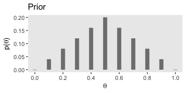
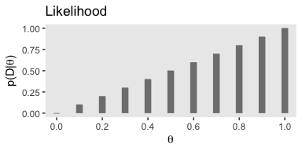
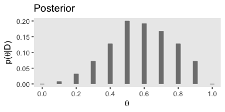

Chapter 05. Bayes' Rule
================
A Solomon Kurz
2018-07-09

5.3. Complete examples: Estimating bias in a coin
-------------------------------------------------

Figure 5.1.a.

``` r
library(tidyverse)

tibble(x = seq(from = 0, to = 1, by = .1),
       y = c(seq(from = 0, to = .5, by = .1),
             seq(from = .4, to = 0, by = -.1))
       ) %>%
  mutate(y = (y * 2) * .2) %>%
  
  ggplot(aes(x = x, y = y, ymin = 0, ymax = y)) +
  geom_linerange(size = 3, color = "grey50") +
  geom_point(shape = 95, color = "grey50", size = 3) +
  scale_x_continuous(breaks = seq(from = 0, to = 1, by = .2)) +
  labs(title = "Prior",
       x = expression(theta),
       y = expression(paste("p(", theta, ")"))) +
  theme(panel.grid = element_blank())
```



Figure 5.1.b.

``` r
tibble(x = seq(from = 0, to = 1, by = .1),
       y = x
       ) %>%
  
  ggplot(aes(x = x, y = y, ymin = 0, ymax = y)) +
  geom_linerange(size = 3, color = "grey50") +
  geom_point(shape = 95, color = "grey50", size = 3) +
  scale_x_continuous(breaks = seq(from = 0, to = 1, by = .2)) +
  labs(title = "Likelihood",
       x = expression(theta),
       y = expression(paste("p(D|", theta, ")"))) +
  theme(panel.grid = element_blank())
```



Figure 5.1.c.

``` r
tibble(x = seq(from = 0, to = 1, by = .1),
       y = c(seq(from = 0, to = .5, by = .1),
             seq(from = .4, to = 0, by = -.1))
       ) %>%
  mutate(y = (x * y * 2) * .4) %>%
  
  ggplot(aes(x = x, y = y, ymin = 0, ymax = y)) +
  geom_linerange(size = 3, color = "grey50") +
  geom_point(shape = 95, color = "grey50", size = 3) +
  scale_x_continuous(breaks = seq(from = 0, to = 1, by = .2)) +
  labs(title = "Posterior",
       x = expression(theta),
       y = expression(paste("p(", theta, "|D)"))) +
  theme(panel.grid = element_blank())
```



References
----------

Kruschke, J. K. (2015). *Doing Bayesian data analysis, Second Edition: A tutorial with R, JAGS, and Stan.* Burlington, MA: Academic Press/Elsevier.

``` r
sessionInfo()
```

    ## R version 3.5.1 (2018-07-02)
    ## Platform: x86_64-apple-darwin15.6.0 (64-bit)
    ## Running under: macOS High Sierra 10.13.4
    ## 
    ## Matrix products: default
    ## BLAS: /Library/Frameworks/R.framework/Versions/3.5/Resources/lib/libRblas.0.dylib
    ## LAPACK: /Library/Frameworks/R.framework/Versions/3.5/Resources/lib/libRlapack.dylib
    ## 
    ## locale:
    ## [1] en_US.UTF-8/en_US.UTF-8/en_US.UTF-8/C/en_US.UTF-8/en_US.UTF-8
    ## 
    ## attached base packages:
    ## [1] stats     graphics  grDevices utils     datasets  methods   base     
    ## 
    ## other attached packages:
    ##  [1] bindrcpp_0.2.2  forcats_0.3.0   stringr_1.3.1   dplyr_0.7.6    
    ##  [5] purrr_0.2.5     readr_1.1.1     tidyr_0.8.1     tibble_1.4.2   
    ##  [9] ggplot2_3.0.0   tidyverse_1.2.1
    ## 
    ## loaded via a namespace (and not attached):
    ##  [1] Rcpp_0.12.17     cellranger_1.1.0 pillar_1.2.3     compiler_3.5.1  
    ##  [5] plyr_1.8.4       bindr_0.1.1      tools_3.5.1      digest_0.6.15   
    ##  [9] lubridate_1.7.4  jsonlite_1.5     evaluate_0.10.1  nlme_3.1-137    
    ## [13] gtable_0.2.0     lattice_0.20-35  pkgconfig_2.0.1  rlang_0.2.1     
    ## [17] psych_1.8.4      cli_1.0.0        rstudioapi_0.7   yaml_2.1.19     
    ## [21] parallel_3.5.1   haven_1.1.2      withr_2.1.2      xml2_1.2.0      
    ## [25] httr_1.3.1       knitr_1.20       hms_0.4.2        rprojroot_1.3-2 
    ## [29] grid_3.5.1       tidyselect_0.2.4 glue_1.2.0       R6_2.2.2        
    ## [33] readxl_1.1.0     foreign_0.8-70   rmarkdown_1.10   modelr_0.1.2    
    ## [37] reshape2_1.4.3   magrittr_1.5     backports_1.1.2  scales_0.5.0    
    ## [41] htmltools_0.3.6  rvest_0.3.2      assertthat_0.2.0 mnormt_1.5-5    
    ## [45] colorspace_1.3-2 labeling_0.3     stringi_1.2.3    lazyeval_0.2.1  
    ## [49] munsell_0.5.0    broom_0.4.5      crayon_1.3.4
