Chapter 06. Interring a Binomial Probability via Exact Mathematical Analysis
================
A Solomon Kurz
2018-07-09

6.1. The likelihood function: The Bernoulli distribution
--------------------------------------------------------

If you follow equation 6.2 closely, here is how we might express it in R.

``` r
Bernoulli_likelihood <- function(theta, data) {
  # theta = success probability parameter ranging from 0 to 1
  # data = the vector of data (i.e., a series of 0s and 1s)
  N   <- length(data)
  z   <- sum(data)
  return(theta^z * (1 - theta)^(N - sum(data)))
  }
```

This will come in handy in just a bit.

6.2. A description of credibilities: The beta distribution
----------------------------------------------------------

### 6.2.1. Specifying a beta prior.

``` r
library(tidyverse)

tibble(x = seq(from = 0, to = 1, length.out = 1e3) %>% 
         rep(., times = 25)) %>% 
  group_by(x) %>% 
  mutate(shape1 = rep(c(.1, 1:4), times = 5),
         shape2 = rep(c(.1, 1:4), each = 5)) %>% 
  mutate(a = paste("a =", shape1),
         b = paste("b =", shape2)) %>% 
  ungroup() %>% 
  mutate(exemplar = rep(1:1e3, each = 25)) %>% 
  
  ggplot(aes(x = x, group = exemplar)) +
  geom_line(aes(y = dbeta(x, shape1 = shape1, shape2 = shape2)),
            color = "grey50", size = 1.25) +
  scale_x_continuous(breaks = c(0, .5, 1)) +
  coord_cartesian(ylim = 0:3) +
  labs(x = expression(theta),
       y = expression(paste("p(", theta, "|a, b)"))) +
  theme(panel.grid = element_blank()) +
  facet_grid(b~a)
```

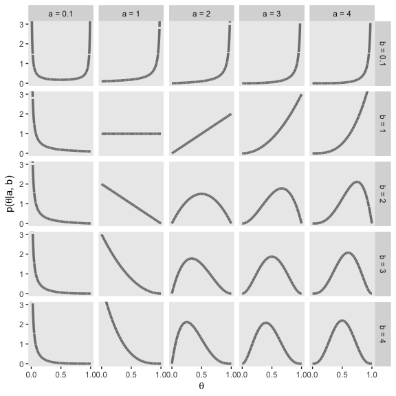

Figure 6.2.

``` r
tibble(x = seq(from = 0, to = 1, length.out = 1e3) %>% 
         rep(., times = 4)) %>% 
  group_by(x) %>% 
  mutate(shape1 = c(5.6, 17.6, 5, 17),
         shape2 = c(1.4, 4.4, 2, 5)) %>% 
  mutate(a = paste("a =", shape1),
         b = paste("b =", shape2),
         kappa = rep(c("kappa = 7", "kappa = 22"), times = 2),
         mu_omega = rep(c("mu = 0.8", "omega = 0.8"), each = 2)) %>% 
  mutate(kappa = factor(kappa, levels = c("kappa = 7", "kappa = 22"))) %>% 
  ungroup() %>%
  
  ggplot(aes(x = x)) +
  geom_vline(xintercept = .8, color = "white") +
  geom_line(aes(y = dbeta(x, shape1 = shape1, shape2 = shape2)),
            color = "grey50", size = 1.25) +
  scale_x_continuous(breaks = c(0, .8, 1)) +
  coord_cartesian(ylim = 0:5) +
  labs(x = expression(theta),
       y = expression(paste("p(", theta, "|a, b)"))) +
  theme(panel.grid = element_blank()) +
  facet_grid(mu_omega~kappa)
```

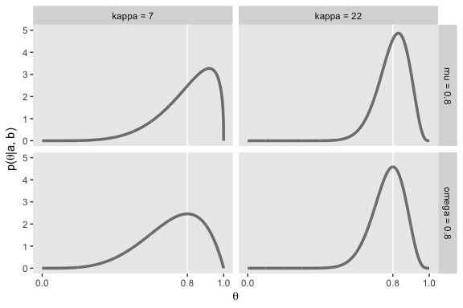

From lines 264 to 290 in his "DBDA2E-utilities.R" file, Kruschke's `betaABfrom...()` functions are as follows:

``` r
# Shape parameters from central tendency and scale:

betaABfromMeanKappa <- function(mean, kappa) {
  if (mean <= 0 | mean >= 1) stop("must have 0 < mean < 1")
  if (kappa <= 0) stop("kappa must be > 0")
  a <- mean * kappa
  b <- (1.0 - mean) * kappa
  return(list(a = a, b = b))
}

betaABfromModeKappa <- function(mode, kappa) {
  if (mode <= 0 | mode >= 1) stop("must have 0 < mode < 1")
  if (kappa <= 2) stop("kappa must be > 2 for mode parameterization")
  a <- mode * (kappa - 2) + 1
  b <- (1.0 - mode) * (kappa - 2) + 1
  return(list(a = a, b = b))
}

betaABfromMeanSD <- function(mean, sd) {
  if (mean <= 0 | mean >= 1) stop("must have 0 < mean < 1")
  if (sd <= 0) stop("sd must be > 0")
  kappa <- mean * (1 - mean)/sd^2 - 1
  if (kappa <= 0) stop("invalid combination of mean and sd")
  a <- mean * kappa
  b <- (1.0 - mean) * kappa
  return(list(a = a, b = b))
}
```

Here's how they work:

``` r
betaABfromMeanKappa(mean = .25, kappa = 4)
```

    ## $a
    ## [1] 1
    ## 
    ## $b
    ## [1] 3

``` r
betaABfromModeKappa(mode = .25, kappa = 4)
```

    ## $a
    ## [1] 1.5
    ## 
    ## $b
    ## [1] 2.5

``` r
betaABfromMeanSD(mean = .5, sd = .1)
```

    ## $a
    ## [1] 12
    ## 
    ## $b
    ## [1] 12

``` r
beta_param <- betaABfromModeKappa(mode = .25, kappa = 4)

beta_param$a
```

    ## [1] 1.5

``` r
beta_param$b
```

    ## [1] 2.5

6.3. The posterior beta
-----------------------

### 6.3.1. Posterior is compromise of prior and likelihood.

Here are the mean calculations from the last paragraph on page 134.

``` r
N <- 10
z <- 1
a <- 5
b <- 5

(proportion_heads <- z/N)
```

    ## [1] 0.1

``` r
(prior_mean <- a/(a + b))
```

    ## [1] 0.5

``` r
(posterior_mean <- (z + a)/(N + a + b))
```

    ## [1] 0.3

In order to make the plots for Figure 6.3., we'll want to compute the prior, likelihood, and posterior density values across a densely-packed range of *θ* values.

``` r
trial_data <- c(rep(0, 9), 1)

d <-
  tibble(theta = seq(from = 0, to = 1, length.out = 100)) %>% 
  mutate(`Prior (beta)`           = dbeta(theta, 
                                          shape1 = a, 
                                          shape2 = b),
         `Likelihood (Bernoulli)` = Bernoulli_likelihood(theta = theta, 
                                                         data = trial_data),
         `Posterior (beta)`       = dbeta(theta, 
                                          shape1 = 6, 
                                          shape2 = 14))

glimpse(d)
```

    ## Observations: 100
    ## Variables: 4
    ## $ theta                    <dbl> 0.00000000, 0.01010101, 0.02020202, 0...
    ## $ `Prior (beta)`           <dbl> 0.000000e+00, 6.297429e-06, 9.670878e...
    ## $ `Likelihood (Bernoulli)` <dbl> 0.000000000, 0.009218977, 0.016812166...
    ## $ `Posterior (beta)`       <dbl> 0.000000e+00, 1.500163e-05, 4.201284e...

To make things easier on ourselves, we'll also make two additional data objects to annotate the plots with lines and text.

``` r
# the data for the in-plot lines
line_tibble <-
  tibble(theta = c(.212 + .008, .788 - .008, 
                   .114 + .004, .497 - .005),
         value = rep(c(.51, .66), each = 2),
         xintercept = c(.212, .788, .114, .497),
         key = rep(c("Prior (beta)", "Posterior (beta)"), each = 2)) %>% 
  mutate(key = factor(key, levels = c("Prior (beta)", "Likelihood (Bernoulli)", "Posterior (beta)")))
  
# the data for the annotation
text_tibble <-
  tibble(theta = c(.5, .3),
         value = c(.8, 1.125),
         label = "95% HDI",
         key = c("Prior (beta)", "Posterior (beta)")) %>% 
  mutate(key = factor(key, levels = c("Prior (beta)", "Likelihood (Bernoulli)", "Posterior (beta)")))
```

Finally, here's our Figure 6.3.

``` r
d %>% 
  gather(key, value, -theta) %>% 
  mutate(key = factor(key, levels = c("Prior (beta)", "Likelihood (Bernoulli)", "Posterior (beta)"))) %>% 
  
  ggplot(aes(x = theta)) +
  geom_ribbon(aes(ymin = 0, ymax = value),
              fill = "grey67") +
  geom_vline(data = line_tibble,
             aes(xintercept = xintercept), 
             linetype = 2, color = "grey92") +
  geom_line(data = line_tibble,
            aes(y = value),
            arrow = arrow(length = unit(.15,"cm"), 
                          ends = "both", 
                          type = "closed"),
            color = "grey92") +
  geom_text(data = text_tibble,
            aes(y = value, label = label),
            color = "grey92") +
  labs(x = expression(theta),
       y = NULL) +
  facet_wrap(~key, scales = "free_y", ncol = 1) +
  theme(panel.grid = element_blank())
```

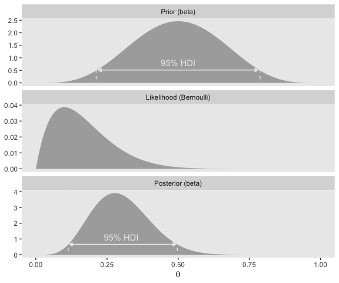

6.4. Examples
-------------

### 6.4.1. Prior knowledge expressed as a beta distribution.

Here are the results Kruschke reported in the first paragraph of this subsection.

``` r
beta_param <- betaABfromModeKappa(mode = .5, kappa = 500)

beta_param$a
```

    ## [1] 250

``` r
beta_param$b
```

    ## [1] 250

Confusingly, it appears Kruschke switched from `dbeta(250, 250)` in the prose to `dbeta(100, 100)` in Figure 6.4.a. So it goes...

``` r
beta_param <- betaABfromModeKappa(mode = .5, kappa = 200)

beta_param$a
```

    ## [1] 100

``` r
beta_param$b
```

    ## [1] 100

``` r
ggplot(data = tibble(x = seq(from = 0, to = 1, by = .001)),
       aes(x = x)) +
  geom_ribbon(aes(ymin = 0,
                  ymax = dbeta(x, 
                               shape1 = beta_param$a, 
                               shape2 = beta_param$b)),
              fill = "grey75") +
  geom_ribbon(data = tibble(x = seq(from = .5 - .069, to = .5 + .069, by = .001)),
              aes(ymin = 0,
                  ymax = dbeta(x, 
                               shape1 = beta_param$a, 
                               shape2 = beta_param$b)),
              fill = "grey67") +
  geom_line(data = tibble(x = c(.5 - .069 + .005, .5 + .069 - .005),
                          y = 1.7),
            aes(x = x, y = y),
            arrow = arrow(length = unit(.15,"cm"), 
                          ends = "both", 
                          type = "closed"),
            color = "grey92") +
  annotate("text", x = .5, y = 3.5, 
           label = "95% HDI", color = "grey0") +
  coord_cartesian(ylim = 0:12) +
  labs(title = "Prior (beta)",
       x = expression(theta),
       y = expression(paste("dbeta(", theta, "|100, 100)"))) +
  theme(panel.grid = element_blank())
```

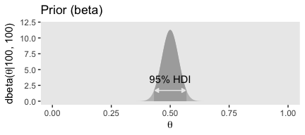

Here are our a and b parameters for Kruschke's free throw example

``` r
beta_param <- betaABfromModeKappa(mode = .75, kappa = 25)

beta_param$a
```

    ## [1] 18.25

``` r
beta_param$b
```

    ## [1] 6.75

Figure 6.4.b.

``` r
ggplot(data = tibble(x = seq(from = 0, to = 1, by = .001)),
       aes(x = x)) +
  geom_ribbon(aes(ymin = 0,
                  ymax = dbeta(x, 
                               shape1 = beta_param$a, 
                               shape2 = beta_param$b)),
              fill = "grey75") +
  geom_ribbon(data = tibble(x = seq(from = .558, to = .892, by = .001)),
              aes(ymin = 0,
                  ymax = dbeta(x, 
                               shape1 = beta_param$a, 
                               shape2 = beta_param$b)),
              fill = "grey67") +
  geom_line(data = tibble(x = c(.558 + .005, .892 - .005),
                          y = .75),
            aes(x = x, y = y),
            arrow = arrow(length = unit(.15,"cm"), 
                          ends = "both", 
                          type = "closed"),
            color = "grey92") +
  annotate("text", x = .73, y = 1.5, 
           label = "95% HDI", color = "grey92") +
  coord_cartesian(ylim = 0:6) +
  labs(title = "Prior (beta)",
       x = expression(theta),
       y = expression(paste("dbeta(", theta, "|18.25, 6.75)"))) +
  theme(panel.grid = element_blank())
```

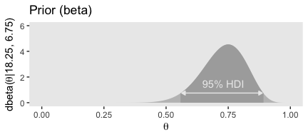

But we can be a little more organized and plot the top row of Figure 6.4 all at once.

``` r
# the data for the in-plot lines
line_tibble <-
  tibble(theta = c(.431 + .005, .569 - .005, 
                   .558 + .005, .892 - .005),
         value = rep(c(1.9, .8), each = 2),
         xintercept = c(.431, .569, 
                        .558, .892),
         exemplar = rep(c("dbeta(theta, 100, 100)", "dbeta(theta, 18.25, 6.75)"), each = 2)) %>%
  mutate(exemplar = factor(exemplar, levels = c("dbeta(theta, 100, 100)", "dbeta(theta, 18.25, 6.75)", "dbeta(theta, 1, 1)")))
  
# the data for the annotation
text_tibble <-
  tibble(theta = c(.5, .735),
         value = c(3.6, 1.45),
         label = "95% HDI",
         exemplar = c("dbeta(theta, 100, 100)", "dbeta(theta, 18.25, 6.75)")) %>%
  mutate(exemplar = factor(exemplar, levels = c("dbeta(theta, 100, 100)", "dbeta(theta, 18.25, 6.75)", "dbeta(theta, 1, 1)")))

# our main data tibble
tibble(theta = seq(from = 0, to = 1, length.out = 100) %>% rep(., times = 3),
       a = rep(c(100, 18.25, 1), each = 100),
       b = rep(c(100, 6.75, 1), each = 100)) %>% 
  mutate(exemplar = ifelse(a == 18.25, str_c("dbeta(theta, ", a, ", ", b, ")"),
                           str_c("dbeta(theta, ", a %>% round(0), ", ", b %>% round(0), ")")),
         density = dbeta(theta, shape1 = a, shape2 = b)) %>% 
  mutate(exemplar = factor(exemplar, levels = c("dbeta(theta, 100, 100)", "dbeta(theta, 18.25, 6.75)", "dbeta(theta, 1, 1)"))) %>% 
  
  # finally, the plot code!
  ggplot(aes(x = theta)) +
  geom_ribbon(aes(ymin = 0, ymax = density),
              size = 0, fill = "grey67") +
  geom_vline(data = line_tibble,
             aes(xintercept = xintercept), 
             linetype = 2, color = "grey92") +
  geom_line(data = line_tibble,
            aes(y = value),
            arrow = arrow(length = unit(.15,"cm"), 
                          ends = "both", 
                          type = "closed"),
            color = "grey92") +
  geom_text(data = text_tibble,
            aes(y = value, label = label),
            color = "grey0") +
  labs(title = "Prior (beta)", 
       x = expression(theta), 
       y = expression(paste("p(", theta, ")"))) +
  theme(panel.grid = element_blank()) +
  facet_wrap(~exemplar, scales = "free_y", ncol = 3)
```

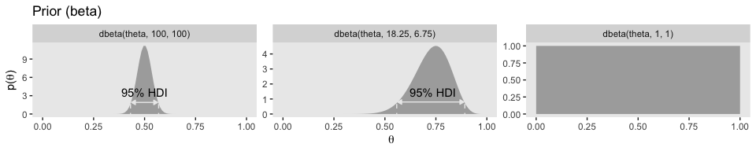

If you look closely, you'll notice the middle row is the same for each column. So we'll just plot it once.

``` r
N <- 20
z <- 17

trial_data <- c(rep(0, times = N - z), rep(1, times = z))

tibble(theta = seq(from = 0, to = 1, length.out = 100)) %>% 
  mutate(likelihood = Bernoulli_likelihood(theta = theta,
                                           data = trial_data)) %>% 
  
  ggplot(aes(x = theta)) +
  geom_ribbon(aes(ymin = 0, ymax = likelihood),
              size = 0, fill = "grey67") +
  labs(title = "Likelihood (Bernoulli)",
       subtitle = "This is the same for all 3 exemplars, so\nthere's no need to plot this thrice.",
       x = expression(theta),
       y = expression(paste("p(D|", theta, ")"))) +
  theme(panel.grid = element_blank())
```

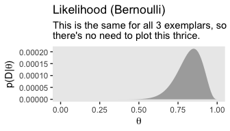

The bottom row:

``` r
# the data for the in-plot lines
line_tibble <-
  tibble(theta = c(.466 + .005, .597 - .005, 
                   .663 + .004, .897 - .005,
                   .660 + .005, .959 - .003),
         value = rep(c(1.9, 1.1, .85), each = 2),
         xintercept = c(.466, .597, 
                        .663, .897,
                        .660, .959),
         exemplar = rep(c("dbeta(theta, 117, 103)", "dbeta(theta, 35.25, 9.75)", "dbeta(theta, 18, 4)"), each = 2)) %>% 
  mutate(exemplar = factor(exemplar, levels = c("dbeta(theta, 117, 103)", "dbeta(theta, 35.25, 9.75)", "dbeta(theta, 18, 4)")))
  
# the data for the annotation
text_tibble <-
  tibble(theta = c(.532, .78, .82),
         value = c(3.5, 2, 1.6),
         label = "95% HDI",
         exemplar = c("dbeta(theta, 117, 103)", "dbeta(theta, 35.25, 9.75)", "dbeta(theta, 18, 4)")) %>%
  mutate(exemplar = factor(exemplar, levels = c("dbeta(theta, 117, 103)", "dbeta(theta, 35.25, 9.75)", "dbeta(theta, 18, 4)")))

# our main data tibble
tibble(theta = seq(from = 0, to = 1, length.out = 100) %>% rep(., times = 3),
       a = rep(c(117, 35.25, 18), each = 100),
       b = rep(c(103, 9.75, 4), each = 100)) %>% 
  mutate(exemplar = ifelse(a == 35.25, str_c("dbeta(theta, ", a, ", ", b, ")"),
                           str_c("dbeta(theta, ", a %>% round(0), ", ", b %>% round(0), ")")),
         density = dbeta(theta, shape1 = a, shape2 = b)) %>% 
  mutate(exemplar = factor(exemplar, levels = c("dbeta(theta, 117, 103)", "dbeta(theta, 35.25, 9.75)", "dbeta(theta, 18, 4)"))) %>% 
  
  # the plot
  ggplot(aes(x = theta)) +
  geom_ribbon(aes(ymin = 0, ymax = density),
              size = 0, fill = "grey67") +
  geom_vline(data = line_tibble,
             aes(xintercept = xintercept), 
             linetype = 2, color = "grey92") +
  geom_line(data = line_tibble,
            aes(y = value),
            arrow = arrow(length = unit(.15,"cm"), 
                          ends = "both", 
                          type = "closed"),
            color = "grey92") +
  geom_text(data = text_tibble,
            aes(y = value, label = label),
            color = "grey0") +
  labs(title = "Posterior (beta)", 
       x = expression(theta), 
       y = expression(paste("p(", theta, "|D)"))) +
  theme(panel.grid = element_blank()) +
  facet_wrap(~exemplar, scales = "free_y", ncol = 3)
```

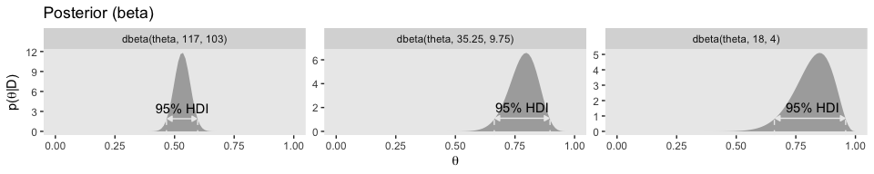

### 6.4.2. Prior knowledge that cannot be expressed as a beta distribution.

For kicks, we'll do this one the way in the text, first, and then in a more tidyverse sort of way.

``` r
theta <- seq(0, 1, length = 1000)  # Fine teeth for Theta.
# Two triangular peaks on a small non-zero floor:
p_theta <-
  c(rep(1, 200), 
    seq(1, 100, length = 50), 
    seq(100, 1, length = 50), 
    rep(1, 200)) %>% 
  rep(., times = 2)

p_theta <- p_theta/sum(p_theta)    # Make p_theta sum to 1.0
```

Here's Kruschke's `BernGrid()` code in all its glory.

``` r
BernGrid = function( Theta , pTheta , Data , plotType=c("Points","Bars")[2] ,
                     showCentTend=c("Mean","Mode","None")[3] ,
                     showHDI=c(TRUE,FALSE)[2] , HDImass=0.95 ,
                     showpD=c(TRUE,FALSE)[2] , nToPlot=length(Theta) ) {
  # Theta is vector of values between 0 and 1.
  # pTheta is prior probability mass at each value of Theta
  # Data is vector of 0's and 1's.
  
  # Check for input errors:
  if ( any( Theta > 1 | Theta < 0 ) ) {
    stop("Theta values must be between 0 and 1")
  }
  if ( any( pTheta < 0 ) ) {
    stop("pTheta values must be non-negative")
  }
  if ( !isTRUE(all.equal( sum(pTheta) , 1.0 )) )  {
    stop("pTheta values must sum to 1.0")
  }
  if ( !all( Data == 1 | Data == 0 ) ) {
    stop("Data values must be 0 or 1")
  }
  
  # Create summary values of Data
  z = sum( Data ) # number of 1's in Data
  N = length( Data ) 

  # Compute the Bernoulli likelihood at each value of Theta:
  pDataGivenTheta = Theta^z * (1-Theta)^(N-z)
  # Compute the evidence and the posterior via Bayes' rule:
  pData = sum( pDataGivenTheta * pTheta )
  pThetaGivenData = pDataGivenTheta * pTheta / pData
  
  # Plot the results.
  layout( matrix( c( 1,2,3 ) ,nrow=3 ,ncol=1 ,byrow=FALSE ) ) # 3x1 panels
  par( mar=c(3,3,1,0) , mgp=c(2,0.7,0) , mai=c(0.5,0.5,0.3,0.1) ) # margins
  cexAxis = 1.33
  cexLab = 1.75
  # convert plotType to notation used by plot:
  if ( plotType=="Points" ) { plotType="p" }
  if ( plotType=="Bars" ) { plotType="h" }
  dotsize = 5 # how big to make the plotted dots
  barsize = 5 # how wide to make the bar lines    
  # If the comb has a zillion teeth, it's too many to plot, so plot only a
  # thinned out subset of the teeth.
  nteeth = length(Theta)
  if ( nteeth > nToPlot ) {
    thinIdx = round( seq( 1, nteeth , length=nteeth ) )
  } else { 
    thinIdx = 1:nteeth 
  }

  # Plot the prior.
  yLim = c(0,1.1*max(c(pTheta,pThetaGivenData)))
  plot( Theta[thinIdx] , pTheta[thinIdx] , type=plotType , 
        pch="." , cex=dotsize , lwd=barsize ,
        xlim=c(0,1) , ylim=yLim , cex.axis=cexAxis ,
        xlab=bquote(theta) , ylab=bquote(p(theta)) , cex.lab=cexLab ,
        main="Prior" , cex.main=1.5 , col="skyblue" )
  if ( showCentTend != "None" ) {
    if ( showCentTend == "Mean" ) {
      meanTheta = sum( Theta * pTheta ) 
      if ( meanTheta > .5 ) {
         textx = 0 ; textadj = c(0,1)
      } else {
        textx = 1 ; textadj = c(1,1)
      }
      text( textx , yLim[2] ,
            bquote( "mean=" * .(signif(meanTheta,3)) ) ,
            cex=2.0 , adj=textadj )
    }
    if ( showCentTend == "Mode" ) {
      modeTheta = Theta[ which.max( pTheta ) ]
      if ( modeTheta > .5 ) {
        textx = 0 ; textadj = c(0,1)
      } else {
        textx = 1 ; textadj = c(1,1)
      }
      text( textx , yLim[2] ,
            bquote( "mode=" * .(signif(modeTheta,3)) ) ,
            cex=2.0 , adj=textadj )
    }
  }
  
  # Mark the highest density interval. HDI points are not thinned in the plot.
  if ( showHDI ) {
    HDIinfo = HDIofGrid( pTheta , credMass=HDImass )
    points( Theta[ HDIinfo$indices ] , 
            rep( HDIinfo$height , length( HDIinfo$indices ) ) , 
            pch="-" , cex=1.0 )
    text( mean( Theta[ HDIinfo$indices ] ) , HDIinfo$height ,
          bquote( .(100*signif(HDIinfo$mass,3)) * "% HDI" ) ,
          adj=c(0.5,-1.5) , cex=1.5 )
    # Mark the left and right ends of the waterline. 
    # Find indices at ends of sub-intervals:
    inLim = HDIinfo$indices[1] # first point
    for ( idx in 2:(length(HDIinfo$indices)-1) ) {
      if ( ( HDIinfo$indices[idx] != HDIinfo$indices[idx-1]+1 ) | # jumps on left, OR
             ( HDIinfo$indices[idx] != HDIinfo$indices[idx+1]-1 ) ) { # jumps on right
        inLim = c(inLim,HDIinfo$indices[idx]) # include idx
      }
    }
    inLim = c(inLim,HDIinfo$indices[length(HDIinfo$indices)]) # last point
    # Mark vertical lines at ends of sub-intervals:
    for ( idx in inLim ) {
      lines( c(Theta[idx],Theta[idx]) , c(-0.5,HDIinfo$height) , type="l" , lty=2 , 
             lwd=1.5 )
      text( Theta[idx] , HDIinfo$height , bquote(.(round(Theta[idx],3))) ,
            adj=c(0.5,-0.1) , cex=1.2 )
    }
  }
  
  # Plot the likelihood: p(Data|Theta)
  plot( Theta[thinIdx] , pDataGivenTheta[thinIdx] , type=plotType , 
        pch="." , cex=dotsize , lwd=barsize ,
        xlim=c(0,1) , ylim=c(0,1.1*max(pDataGivenTheta)) , cex.axis=cexAxis ,
        xlab=bquote(theta) , ylab=bquote( "p(D|" * theta * ")" ) , cex.lab=cexLab ,
        main="Likelihood" , cex.main=1.5 , col="skyblue" )
  if ( z > .5*N ) { textx = 0 ; textadj = c(0,1) }
  else { textx = 1 ; textadj = c(1,1) }
  text( textx ,1.0*max(pDataGivenTheta) ,cex=2.0
    ,bquote( "Data: z=" * .(z) * ",N=" * .(N) ) ,adj=textadj )
  if ( showCentTend != "None" ) {
    if ( showCentTend == "Mean" ) {
      meanTheta = sum( Theta * pDataGivenTheta ) 
      if ( meanTheta > .5 ) {
        textx = 0 ; textadj = c(0,1)
      } else {
        textx = 1 ; textadj = c(1,1)
      }
      text( textx , 0.7*max(pDataGivenTheta) ,
            bquote( "mean=" * .(signif(meanTheta,3)) ) ,
            cex=2.0 , adj=textadj )
    }
    if ( showCentTend == "Mode" ) {
      modeTheta = Theta[ which.max( pDataGivenTheta ) ]
      if ( modeTheta > .5 ) {
        textx = 0 ; textadj = c(0,1)
      } else {
        textx = 1 ; textadj = c(1,1)
      }
      text( textx , 0.7*max(pDataGivenTheta) ,
            bquote( "mode=" * .(signif(modeTheta,3)) ) ,
            cex=2.0 , adj=textadj )
    }
  }
  
  # Plot the posterior.
  yLim = c(0,1.1*max(c(pTheta,pThetaGivenData)))
  plot( Theta[thinIdx] , pThetaGivenData[thinIdx] , type=plotType , 
        pch="." , cex=dotsize , lwd=barsize ,
        xlim=c(0,1) , ylim=yLim , cex.axis=cexAxis ,
        xlab=bquote(theta) , ylab=bquote( "p(" * theta * "|D)" ) , cex.lab=cexLab ,
        main="Posterior" , cex.main=1.5 , col="skyblue" )
  if ( showCentTend != "None" ) {
    if ( showCentTend == "Mean" ) {
      meanTheta = sum( Theta * pThetaGivenData ) 
      if ( meanTheta > .5 ) {
        textx = 0 ; textadj = c(0,1)
      } else {
        textx = 1 ; textadj = c(1,1)
      }
      text( textx , yLim[2] ,
            bquote( "mean=" * .(signif(meanTheta,3)) ) ,
            cex=2.0 , adj=textadj )
    }
    if ( showCentTend == "Mode" ) {
      modeTheta = Theta[ which.max( pThetaGivenData ) ]
      if ( modeTheta > .5 ) {
        textx = 0 ; textadj = c(0,1)
      } else {
        textx = 1 ; textadj = c(1,1)
      }
      text( textx , yLim[2] ,
            bquote( "mode=" * .(signif(modeTheta,3)) ) ,
            cex=2.0 , adj=textadj )
    }
  }

  
  # Plot marginal likelihood pData:
  if ( showpD ) {
    meanTheta = sum( Theta * pThetaGivenData ) 
    if ( meanTheta > .5 ) {
      textx = 0 ; textadj = c(0,1)
    } else {
      textx = 1 ; textadj = c(1,1)
    }
    text( textx , 0.75*max(pThetaGivenData) , cex=2.0 ,
            bquote( "p(D)=" * .(signif(pData,3)) ) ,adj=textadj )
  }
  
  # Mark the highest density interval. HDI points are not thinned in the plot.
  if ( showHDI ) {
    HDIinfo = HDIofGrid( pThetaGivenData , credMass=HDImass )
    points( Theta[ HDIinfo$indices ] , 
            rep( HDIinfo$height , length( HDIinfo$indices ) ) , 
            pch="-" , cex=1.0 )
    text( mean( Theta[ HDIinfo$indices ] ) , HDIinfo$height ,
             bquote( .(100*signif(HDIinfo$mass,3)) * "% HDI" ) ,
             adj=c(0.5,-1.5) , cex=1.5 )
    # Mark the left and right ends of the waterline. 
    # Find indices at ends of sub-intervals:
    inLim = HDIinfo$indices[1] # first point
    for ( idx in 2:(length(HDIinfo$indices)-1) ) {
      if ( ( HDIinfo$indices[idx] != HDIinfo$indices[idx-1]+1 ) | # jumps on left, OR
        ( HDIinfo$indices[idx] != HDIinfo$indices[idx+1]-1 ) ) { # jumps on right
        inLim = c(inLim,HDIinfo$indices[idx]) # include idx
      }
    }
    inLim = c(inLim,HDIinfo$indices[length(HDIinfo$indices)]) # last point
    # Mark vertical lines at ends of sub-intervals:
    for ( idx in inLim ) {
      lines( c(Theta[idx],Theta[idx]) , c(-0.5,HDIinfo$height) , type="l" , lty=2 , 
             lwd=1.5 )
      text( Theta[idx] , HDIinfo$height , bquote(.(round(Theta[idx],3))) ,
            adj=c(0.5,-0.1) , cex=1.2 )
    }
  }
  
  return( pThetaGivenData )
} # end of function
```

Here's the plot using Kruschke's method.

``` r
Data <- c(rep(0, 13), rep(1, 14))

BernGrid(theta, p_theta, Data, plotType = "Bars",
         showCentTend = "None", showHDI = FALSE, showpD = FALSE)
```

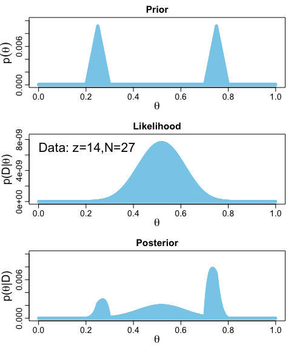

    ##    [1] 0.000000e+00 2.589202e-37 4.187221e-33 1.206529e-30 6.683575e-29
    ##    [6] 1.499933e-27 1.900757e-26 1.623653e-25 1.039169e-24 5.334842e-24
    ##   [11] 2.301551e-23 8.625946e-23 2.878255e-22 8.711154e-22 2.426232e-21
    ##   [16] 6.290466e-21 1.532302e-20 3.533484e-20 7.762132e-20 1.632895e-19
    ##   [21] 3.304181e-19 6.455712e-19 1.221844e-18 2.246499e-18 4.022409e-18
    ##   [26] 7.029031e-18 1.201054e-17 2.010125e-17 3.300132e-17 5.321982e-17
    ##   [31] 8.440643e-17 1.317990e-16 2.028209e-16 3.078695e-16 4.613482e-16
    ##   [36] 6.830035e-16 9.996446e-16 1.447335e-15 2.074165e-15 2.943740e-15
    ##   [41] 4.139526e-15 5.770248e-15 7.976533e-15 1.093906e-14 1.488847e-14
    ##   [46] 2.011745e-14 2.699518e-14 3.598481e-14 4.766427e-14 6.275103e-14
    ##   [51] 8.213149e-14 1.068956e-13 1.383775e-13 1.782033e-13 2.283469e-13
    ##   [56] 2.911940e-13 3.696181e-13 4.670664e-13 5.876597e-13 7.363074e-13
    ##   [61] 9.188383e-13 1.142151e-12 1.414384e-12 1.745109e-12 2.145554e-12
    ##   [66] 2.628847e-12 3.210298e-12 3.907716e-12 4.741759e-12 5.736335e-12
    ##   [71] 6.919038e-12 8.321650e-12 9.980686e-12 1.193800e-11 1.424149e-11
    ##   [76] 1.694580e-11 2.011321e-11 2.381447e-11 2.812992e-11 3.315049e-11
    ##   [81] 3.897897e-11 4.573135e-11 5.353825e-11 6.254655e-11 7.292108e-11
    ##   [86] 8.484659e-11 9.852973e-11 1.142014e-10 1.321190e-10 1.525693e-10
    ##   [91] 1.758711e-10 2.023785e-10 2.324841e-10 2.666225e-10 3.052744e-10
    ##   [96] 3.489707e-10 3.982969e-10 4.538979e-10 5.164832e-10 5.868326e-10
    ##  [101] 6.658017e-10 7.543285e-10 8.534401e-10 9.642600e-10 1.088016e-09
    ##  [106] 1.226046e-09 1.379812e-09 1.550904e-09 1.741051e-09 1.952135e-09
    ##  [111] 2.186197e-09 2.445452e-09 2.732299e-09 3.049337e-09 3.399377e-09
    ##  [116] 3.785455e-09 4.210851e-09 4.679102e-09 5.194022e-09 5.759716e-09
    ##  [121] 6.380603e-09 7.061432e-09 7.807306e-09 8.623704e-09 9.516498e-09
    ##  [126] 1.049199e-08 1.155691e-08 1.271848e-08 1.398442e-08 1.536297e-08
    ##  [131] 1.686293e-08 1.849368e-08 2.026526e-08 2.218832e-08 2.427423e-08
    ##  [136] 2.653507e-08 2.898371e-08 3.163379e-08 3.449984e-08 3.759724e-08
    ##  [141] 4.094233e-08 4.455241e-08 4.844583e-08 5.264200e-08 5.716145e-08
    ##  [146] 6.202592e-08 6.725836e-08 7.288301e-08 7.892547e-08 8.541274e-08
    ##  [151] 9.237331e-08 9.983716e-08 1.078359e-07 1.164029e-07 1.255730e-07
    ##  [156] 1.353831e-07 1.458719e-07 1.570801e-07 1.690503e-07 1.818274e-07
    ##  [161] 1.954583e-07 2.099923e-07 2.254810e-07 2.419786e-07 2.595416e-07
    ##  [166] 2.782292e-07 2.981035e-07 3.192293e-07 3.416742e-07 3.655089e-07
    ##  [171] 3.908073e-07 4.176465e-07 4.461067e-07 4.762719e-07 5.082293e-07
    ##  [176] 5.420699e-07 5.778886e-07 6.157838e-07 6.558582e-07 6.982186e-07
    ##  [181] 7.429758e-07 7.902452e-07 8.401466e-07 8.928042e-07 9.483471e-07
    ##  [186] 1.006909e-06 1.068630e-06 1.133652e-06 1.202126e-06 1.274205e-06
    ##  [191] 1.350051e-06 1.429828e-06 1.513708e-06 1.601868e-06 1.694492e-06
    ##  [196] 1.791769e-06 1.893895e-06 2.001073e-06 2.113510e-06 2.231422e-06
    ##  [201] 2.355033e-06 7.504416e-06 1.320831e-05 1.950578e-05 2.643795e-05
    ##  [206] 3.404805e-05 4.238150e-05 5.148597e-05 6.141151e-05 7.221058e-05
    ##  [211] 8.393817e-05 9.665187e-05 1.104119e-04 1.252815e-04 1.413263e-04
    ##  [216] 1.586154e-04 1.772207e-04 1.972172e-04 2.186832e-04 2.417005e-04
    ##  [221] 2.663541e-04 2.927326e-04 3.209282e-04 3.510371e-04 3.831589e-04
    ##  [226] 4.173976e-04 4.538608e-04 4.926606e-04 5.339132e-04 5.777392e-04
    ##  [231] 6.242636e-04 6.736162e-04 7.259311e-04 7.813475e-04 8.400095e-04
    ##  [236] 9.020660e-04 9.676712e-04 1.036984e-03 1.110171e-03 1.187400e-03
    ##  [241] 1.268847e-03 1.354695e-03 1.445130e-03 1.540345e-03 1.640539e-03
    ##  [246] 1.745918e-03 1.856692e-03 1.973080e-03 2.095305e-03 2.223597e-03
    ##  [251] 2.311493e-03 2.353734e-03 2.395140e-03 2.435599e-03 2.474997e-03
    ##  [256] 2.513214e-03 2.550122e-03 2.585591e-03 2.619484e-03 2.651660e-03
    ##  [261] 2.681971e-03 2.710264e-03 2.736379e-03 2.760151e-03 2.781410e-03
    ##  [266] 2.799977e-03 2.815671e-03 2.828301e-03 2.837670e-03 2.843577e-03
    ##  [271] 2.845812e-03 2.844159e-03 2.838396e-03 2.828292e-03 2.813611e-03
    ##  [276] 2.794111e-03 2.769539e-03 2.739639e-03 2.704145e-03 2.662785e-03
    ##  [281] 2.615280e-03 2.561341e-03 2.500675e-03 2.432979e-03 2.357944e-03
    ##  [286] 2.275252e-03 2.184578e-03 2.085590e-03 1.977947e-03 1.861301e-03
    ##  [291] 1.735296e-03 1.599569e-03 1.453748e-03 1.297453e-03 1.130298e-03
    ##  [296] 9.518875e-04 7.618195e-04 5.596835e-04 3.450615e-04 1.175276e-04
    ##  [301] 1.208843e-04 1.243141e-04 1.278181e-04 1.313971e-04 1.350522e-04
    ##  [306] 1.387841e-04 1.425939e-04 1.464824e-04 1.504505e-04 1.544990e-04
    ##  [311] 1.586290e-04 1.628411e-04 1.671363e-04 1.715154e-04 1.759792e-04
    ##  [316] 1.805286e-04 1.851643e-04 1.898871e-04 1.946978e-04 1.995971e-04
    ##  [321] 2.045859e-04 2.096647e-04 2.148344e-04 2.200955e-04 2.254489e-04
    ##  [326] 2.308950e-04 2.364346e-04 2.420683e-04 2.477967e-04 2.536202e-04
    ##  [331] 2.595396e-04 2.655552e-04 2.716676e-04 2.778773e-04 2.841848e-04
    ##  [336] 2.905904e-04 2.970945e-04 3.036976e-04 3.104000e-04 3.172019e-04
    ##  [341] 3.241038e-04 3.311058e-04 3.382082e-04 3.454112e-04 3.527150e-04
    ##  [346] 3.601198e-04 3.676255e-04 3.752324e-04 3.829404e-04 3.907496e-04
    ##  [351] 3.986599e-04 4.066714e-04 4.147838e-04 4.229972e-04 4.313113e-04
    ##  [356] 4.397260e-04 4.482409e-04 4.568559e-04 4.655707e-04 4.743849e-04
    ##  [361] 4.832981e-04 4.923099e-04 5.014198e-04 5.106274e-04 5.199322e-04
    ##  [366] 5.293334e-04 5.388307e-04 5.484232e-04 5.581103e-04 5.678912e-04
    ##  [371] 5.777652e-04 5.877315e-04 5.977892e-04 6.079374e-04 6.181751e-04
    ##  [376] 6.285015e-04 6.389153e-04 6.494157e-04 6.600014e-04 6.706714e-04
    ##  [381] 6.814244e-04 6.922592e-04 7.031745e-04 7.141690e-04 7.252413e-04
    ##  [386] 7.363901e-04 7.476138e-04 7.589111e-04 7.702803e-04 7.817199e-04
    ##  [391] 7.932283e-04 8.048038e-04 8.164448e-04 8.281494e-04 8.399160e-04
    ##  [396] 8.517427e-04 8.636277e-04 8.755690e-04 8.875647e-04 8.996129e-04
    ##  [401] 9.117115e-04 9.238586e-04 9.360519e-04 9.482894e-04 9.605690e-04
    ##  [406] 9.728883e-04 9.852453e-04 9.976376e-04 1.010063e-03 1.022519e-03
    ##  [411] 1.035003e-03 1.047514e-03 1.060047e-03 1.072602e-03 1.085175e-03
    ##  [416] 1.097765e-03 1.110367e-03 1.122981e-03 1.135603e-03 1.148231e-03
    ##  [421] 1.160861e-03 1.173492e-03 1.186120e-03 1.198744e-03 1.211359e-03
    ##  [426] 1.223964e-03 1.236555e-03 1.249130e-03 1.261685e-03 1.274219e-03
    ##  [431] 1.286728e-03 1.299209e-03 1.311659e-03 1.324076e-03 1.336457e-03
    ##  [436] 1.348798e-03 1.361096e-03 1.373350e-03 1.385555e-03 1.397708e-03
    ##  [441] 1.409808e-03 1.421850e-03 1.433832e-03 1.445750e-03 1.457603e-03
    ##  [446] 1.469386e-03 1.481097e-03 1.492733e-03 1.504291e-03 1.515768e-03
    ##  [451] 1.527160e-03 1.538465e-03 1.549681e-03 1.560803e-03 1.571829e-03
    ##  [456] 1.582757e-03 1.593582e-03 1.604303e-03 1.614916e-03 1.625419e-03
    ##  [461] 1.635809e-03 1.646082e-03 1.656236e-03 1.666269e-03 1.676177e-03
    ##  [466] 1.685957e-03 1.695608e-03 1.705126e-03 1.714508e-03 1.723753e-03
    ##  [471] 1.732857e-03 1.741817e-03 1.750632e-03 1.759298e-03 1.767814e-03
    ##  [476] 1.776177e-03 1.784383e-03 1.792432e-03 1.800321e-03 1.808046e-03
    ##  [481] 1.815607e-03 1.823001e-03 1.830225e-03 1.837278e-03 1.844157e-03
    ##  [486] 1.850861e-03 1.857387e-03 1.863734e-03 1.869899e-03 1.875881e-03
    ##  [491] 1.881677e-03 1.887287e-03 1.892709e-03 1.897940e-03 1.902979e-03
    ##  [496] 1.907825e-03 1.912477e-03 1.916932e-03 1.921189e-03 1.925248e-03
    ##  [501] 1.929106e-03 1.932763e-03 1.936217e-03 1.939467e-03 1.942513e-03
    ##  [506] 1.945353e-03 1.947987e-03 1.950413e-03 1.952631e-03 1.954640e-03
    ##  [511] 1.956440e-03 1.958029e-03 1.959408e-03 1.960575e-03 1.961531e-03
    ##  [516] 1.962275e-03 1.962806e-03 1.963125e-03 1.963231e-03 1.963125e-03
    ##  [521] 1.962806e-03 1.962274e-03 1.961530e-03 1.960573e-03 1.959403e-03
    ##  [526] 1.958022e-03 1.956429e-03 1.954625e-03 1.952610e-03 1.950385e-03
    ##  [531] 1.947951e-03 1.945308e-03 1.942456e-03 1.939397e-03 1.936132e-03
    ##  [536] 1.932661e-03 1.928985e-03 1.925106e-03 1.921024e-03 1.916741e-03
    ##  [541] 1.912258e-03 1.907576e-03 1.902696e-03 1.897621e-03 1.892351e-03
    ##  [546] 1.886887e-03 1.881233e-03 1.875388e-03 1.869355e-03 1.863135e-03
    ##  [551] 1.856731e-03 1.850144e-03 1.843375e-03 1.836428e-03 1.829303e-03
    ##  [556] 1.822004e-03 1.814531e-03 1.806888e-03 1.799075e-03 1.791097e-03
    ##  [561] 1.782954e-03 1.774649e-03 1.766184e-03 1.757562e-03 1.748786e-03
    ##  [566] 1.739857e-03 1.730779e-03 1.721553e-03 1.712183e-03 1.702670e-03
    ##  [571] 1.693018e-03 1.683230e-03 1.673307e-03 1.663253e-03 1.653071e-03
    ##  [576] 1.642763e-03 1.632332e-03 1.621781e-03 1.611113e-03 1.600330e-03
    ##  [581] 1.589436e-03 1.578434e-03 1.567326e-03 1.556116e-03 1.544806e-03
    ##  [586] 1.533400e-03 1.521900e-03 1.510310e-03 1.498632e-03 1.486871e-03
    ##  [591] 1.475027e-03 1.463106e-03 1.451109e-03 1.439041e-03 1.426903e-03
    ##  [596] 1.414699e-03 1.402433e-03 1.390107e-03 1.377724e-03 1.365288e-03
    ##  [601] 1.352801e-03 1.340267e-03 1.327689e-03 1.315069e-03 1.302412e-03
    ##  [606] 1.289719e-03 1.276994e-03 1.264240e-03 1.251460e-03 1.238656e-03
    ##  [611] 1.225833e-03 1.212993e-03 1.200138e-03 1.187273e-03 1.174399e-03
    ##  [616] 1.161519e-03 1.148637e-03 1.135756e-03 1.122877e-03 1.110004e-03
    ##  [621] 1.097141e-03 1.084288e-03 1.071450e-03 1.058628e-03 1.045826e-03
    ##  [626] 1.033047e-03 1.020292e-03 1.007564e-03 9.948663e-04 9.822009e-04
    ##  [631] 9.695704e-04 9.569771e-04 9.444236e-04 9.319121e-04 9.194449e-04
    ##  [636] 9.070245e-04 8.946530e-04 8.823327e-04 8.700656e-04 8.578541e-04
    ##  [641] 8.457000e-04 8.336056e-04 8.215729e-04 8.096037e-04 7.977000e-04
    ##  [646] 7.858638e-04 7.740969e-04 7.624010e-04 7.507779e-04 7.392294e-04
    ##  [651] 7.277571e-04 7.163626e-04 7.050475e-04 6.938134e-04 6.826618e-04
    ##  [656] 6.715940e-04 6.606116e-04 6.497158e-04 6.389080e-04 6.281894e-04
    ##  [661] 6.175613e-04 6.070248e-04 5.965810e-04 5.862311e-04 5.759761e-04
    ##  [666] 5.658170e-04 5.557547e-04 5.457901e-04 5.359241e-04 5.261575e-04
    ##  [671] 5.164910e-04 5.069255e-04 4.974615e-04 4.880997e-04 4.788408e-04
    ##  [676] 4.696852e-04 4.606334e-04 4.516859e-04 4.428432e-04 4.341057e-04
    ##  [681] 4.254735e-04 4.169472e-04 4.085268e-04 4.002126e-04 3.920049e-04
    ##  [686] 3.839037e-04 3.759091e-04 3.680213e-04 3.602401e-04 3.525657e-04
    ##  [691] 3.449978e-04 3.375366e-04 3.301818e-04 3.229332e-04 3.157907e-04
    ##  [696] 3.087541e-04 3.018231e-04 2.949973e-04 2.882765e-04 2.816603e-04
    ##  [701] 2.751483e-04 8.117050e-04 1.322888e-03 1.809321e-03 2.271623e-03
    ##  [706] 2.710408e-03 3.126286e-03 3.519861e-03 3.891735e-03 4.242501e-03
    ##  [711] 4.572747e-03 4.883057e-03 5.174008e-03 5.446169e-03 5.700105e-03
    ##  [716] 5.936373e-03 6.155523e-03 6.358099e-03 6.544636e-03 6.715664e-03
    ##  [721] 6.871704e-03 7.013269e-03 7.140864e-03 7.254989e-03 7.356132e-03
    ##  [726] 7.444775e-03 7.521392e-03 7.586447e-03 7.640398e-03 7.683693e-03
    ##  [731] 7.716771e-03 7.740063e-03 7.753993e-03 7.758973e-03 7.755409e-03
    ##  [736] 7.743697e-03 7.724225e-03 7.697370e-03 7.663504e-03 7.622988e-03
    ##  [741] 7.576173e-03 7.523403e-03 7.465013e-03 7.401330e-03 7.332670e-03
    ##  [746] 7.259343e-03 7.181648e-03 7.099878e-03 7.014315e-03 6.925234e-03
    ##  [751] 6.697583e-03 6.345056e-03 6.007110e-03 5.683290e-03 5.373152e-03
    ##  [756] 5.076259e-03 4.792184e-03 4.520509e-03 4.260825e-03 4.012729e-03
    ##  [761] 3.775831e-03 3.549747e-03 3.334102e-03 3.128530e-03 2.932674e-03
    ##  [766] 2.746185e-03 2.568722e-03 2.399953e-03 2.239555e-03 2.087212e-03
    ##  [771] 1.942617e-03 1.805470e-03 1.675480e-03 1.552365e-03 1.435848e-03
    ##  [776] 1.325661e-03 1.221546e-03 1.123249e-03 1.030525e-03 9.431355e-04
    ##  [781] 8.608511e-04 7.834478e-04 7.107089e-04 6.424250e-04 5.783930e-04
    ##  [786] 5.184167e-04 4.623062e-04 4.098783e-04 3.609558e-04 3.153677e-04
    ##  [791] 2.729491e-04 2.335409e-04 1.969898e-04 1.631482e-04 1.318739e-04
    ##  [796] 1.030303e-04 7.648572e-05 5.211396e-05 2.979365e-05 9.408356e-06
    ##  [801] 8.970542e-06 8.550108e-06 8.146498e-06 7.759173e-06 7.387602e-06
    ##  [806] 7.031269e-06 6.689667e-06 6.362303e-06 6.048695e-06 5.748374e-06
    ##  [811] 5.460880e-06 5.185766e-06 4.922596e-06 4.670945e-06 4.430401e-06
    ##  [816] 4.200559e-06 3.981028e-06 3.771427e-06 3.571384e-06 3.380540e-06
    ##  [821] 3.198543e-06 3.025054e-06 2.859742e-06 2.702286e-06 2.552375e-06
    ##  [826] 2.409708e-06 2.273992e-06 2.144943e-06 2.022288e-06 1.905760e-06
    ##  [831] 1.795103e-06 1.690067e-06 1.590412e-06 1.495905e-06 1.406322e-06
    ##  [836] 1.321446e-06 1.241068e-06 1.164985e-06 1.093003e-06 1.024934e-06
    ##  [841] 9.605976e-07 8.998186e-07 8.424297e-07 7.882695e-07 7.371828e-07
    ##  [846] 6.890206e-07 6.436393e-07 6.009015e-07 5.606749e-07 5.228329e-07
    ##  [851] 4.872539e-07 4.538215e-07 4.224240e-07 3.929547e-07 3.653113e-07
    ##  [856] 3.393961e-07 3.151157e-07 2.923808e-07 2.711062e-07 2.512104e-07
    ##  [861] 2.326160e-07 2.152490e-07 1.990389e-07 1.839187e-07 1.698245e-07
    ##  [866] 1.566956e-07 1.444743e-07 1.331059e-07 1.225383e-07 1.127222e-07
    ##  [871] 1.036107e-07 9.515961e-08 8.732690e-08 8.007287e-08 7.335996e-08
    ##  [876] 6.715271e-08 6.141760e-08 5.612301e-08 5.123915e-08 4.673791e-08
    ##  [881] 4.259286e-08 3.877910e-08 3.527323e-08 3.205329e-08 2.909863e-08
    ##  [886] 2.638990e-08 2.390896e-08 2.163883e-08 1.956362e-08 1.766845e-08
    ##  [891] 1.593945e-08 1.436367e-08 1.292903e-08 1.162427e-08 1.043891e-08
    ##  [896] 9.363211e-09 8.388126e-09 7.505253e-09 6.706802e-09 5.985557e-09
    ##  [901] 5.334842e-09 4.748484e-09 4.220782e-09 3.746480e-09 3.320732e-09
    ##  [906] 2.939078e-09 2.597419e-09 2.291990e-09 2.019337e-09 1.776298e-09
    ##  [911] 1.559978e-09 1.367732e-09 1.197145e-09 1.046019e-09 9.123504e-10
    ##  [916] 7.943189e-10 6.902727e-10 5.987143e-10 5.182886e-10 4.477709e-10
    ##  [921] 3.860563e-10 3.321495e-10 2.851551e-10 2.442696e-10 2.087723e-10
    ##  [926] 1.780186e-10 1.514328e-10 1.285013e-10 1.087675e-10 9.182552e-11
    ##  [931] 7.731582e-11 6.492026e-11 5.435808e-11 4.538194e-11 3.777451e-11
    ##  [936] 3.134520e-11 2.592734e-11 2.137544e-11 1.756291e-11 1.437982e-11
    ##  [941] 1.173100e-11 9.534272e-12 7.718886e-12 6.224105e-12 4.997948e-12
    ##  [946] 3.996070e-12 3.180761e-12 2.520067e-12 1.987000e-12 1.558856e-12
    ##  [951] 1.216602e-12 9.443483e-13 7.288838e-13 5.592697e-13 4.264900e-13
    ##  [956] 3.231476e-13 2.432032e-13 1.817510e-13 1.348268e-13 9.924515e-14
    ##  [961] 7.246129e-14 5.245454e-14 3.763070e-14 2.674049e-14 1.881187e-14
    ##  [966] 1.309415e-14 9.012180e-15 6.128995e-15 4.115531e-15 2.726328e-15
    ##  [971] 1.780111e-15 1.144439e-15 7.236449e-16 4.494715e-16 2.738510e-16
    ##  [976] 1.634104e-16 9.532969e-17 5.426098e-17 3.006517e-17 1.617397e-17
    ##  [981] 8.422301e-18 4.230362e-18 2.041107e-18 9.414081e-19 4.126545e-19
    ##  [986] 1.707028e-19 6.607076e-20 2.367365e-20 7.747668e-21 2.276234e-21
    ##  [991] 5.868326e-22 1.287271e-22 2.300948e-23 3.145753e-24 2.981867e-25
    ##  [996] 1.662539e-26 4.005677e-28 2.087330e-30 2.584024e-34 0.000000e+00

It works fine. However, I'm not a fan of the method. It's clear that a lot of thought went into his `BernGrid()` function. However, its inner workings are too opaque, for me. I wanna get my hands dirty and make my own plots so that I know exactly what's going on. Before we make our plots with ggplot2, let's first get the data into a tibble.

``` r
# we need these to compute the likelihood
N <- 27
z <- 14

trial_data <- c(rep(0, times = N - z), rep(1, times = z))        # (i.e., Data)

d <-
  tibble(theta = seq(from = 0, to = 1, length.out = 1000),       # (i.e., Theta)
         Prior = c(rep(1, 200),                                  # (i.e., pTheta)
                   seq(1, 100, length = 50), 
                   seq(100, 1, length = 50), 
                   rep(1, 200)) %>% 
           rep(., times = 2)) %>% 
  mutate(Prior = Prior/sum(Prior),
         Likelihood = Bernoulli_likelihood(theta = theta,        # (i.e., pDataGivenTheta)
                                           data = trial_data)) %>%
  mutate(normalizing_constant = sum(Likelihood * Prior)) %>%     # (i.e., pData)
  mutate(Posterior = Likelihood * Prior / normalizing_constant)  # (i.e., pThetaGivenData)
  
glimpse(d)
```

    ## Observations: 1,000
    ## Variables: 5
    ## $ theta                <dbl> 0.000000000, 0.001001001, 0.002002002, 0....
    ## $ Prior                <dbl> 9.174312e-05, 9.174312e-05, 9.174312e-05,...
    ## $ Likelihood           <dbl> 0.000000e+00, 1.000988e-42, 1.618784e-38,...
    ## $ normalizing_constant <dbl> 3.546798e-10, 3.546798e-10, 3.546798e-10,...
    ## $ Posterior            <dbl> 0.000000e+00, 2.589202e-37, 4.187221e-33,...

With our nice tibble in hand, we'll plot the prior, likelihood, and posterior one at a time.

``` r
(plot_1 <-
  d %>% 
  ggplot(aes(x = theta)) +
  geom_ribbon(aes(ymin = 0, ymax = Prior),
              fill = "grey50") +
  labs(title = "Prior",
       x = expression(theta),
       y = expression(paste("p(", theta, ")"))) +
  theme(panel.grid = element_blank())
 )
```

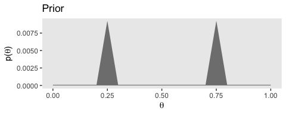

``` r
(plot_2 <-
  d %>% 
  ggplot(aes(x = theta)) +
  geom_ribbon(aes(ymin = 0, ymax = Likelihood),
              fill = "grey50") +
  labs(title = "Likelihood",
       x = expression(theta),
       y = expression(paste("p(D|", theta, ")"))) +
  theme(panel.grid = element_blank())
 )
```

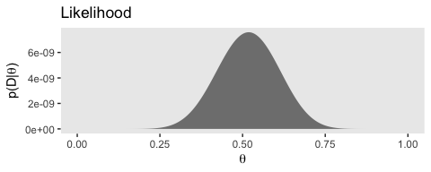

``` r
(plot_3 <-
  d %>% 
  ggplot(aes(x = theta)) +
  geom_ribbon(aes(ymin = 0, ymax = Posterior),
              fill = "grey50") +
  labs(title = "Posterior",
       x = expression(theta),
       y = expression(paste("p(", theta, "|D)"))) +
  theme(panel.grid = element_blank())
 )
```

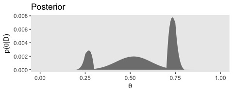

Note how we saved each the plots as objects. If we want to stack the plots one atop another like they’re presented in Figure 6.5, we can use `grid.arrange()` from the [gridExtra package](https://cran.r-project.org/web/packages/gridExtra/index.html).

``` r
library(gridExtra)

grid.arrange(plot_1, plot_2, plot_3)
```

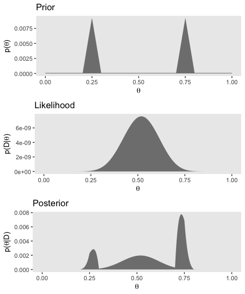

References
----------

Kruschke, J. K. (2015). *Doing Bayesian data analysis, Second Edition: A tutorial with R, JAGS, and Stan.* Burlington, MA: Academic Press/Elsevier.

``` r
sessionInfo()
```

    ## R version 3.5.1 (2018-07-02)
    ## Platform: x86_64-apple-darwin15.6.0 (64-bit)
    ## Running under: macOS High Sierra 10.13.4
    ## 
    ## Matrix products: default
    ## BLAS: /Library/Frameworks/R.framework/Versions/3.5/Resources/lib/libRblas.0.dylib
    ## LAPACK: /Library/Frameworks/R.framework/Versions/3.5/Resources/lib/libRlapack.dylib
    ## 
    ## locale:
    ## [1] en_US.UTF-8/en_US.UTF-8/en_US.UTF-8/C/en_US.UTF-8/en_US.UTF-8
    ## 
    ## attached base packages:
    ## [1] stats     graphics  grDevices utils     datasets  methods   base     
    ## 
    ## other attached packages:
    ##  [1] gridExtra_2.3   bindrcpp_0.2.2  forcats_0.3.0   stringr_1.3.1  
    ##  [5] dplyr_0.7.6     purrr_0.2.5     readr_1.1.1     tidyr_0.8.1    
    ##  [9] tibble_1.4.2    ggplot2_3.0.0   tidyverse_1.2.1
    ## 
    ## loaded via a namespace (and not attached):
    ##  [1] tidyselect_0.2.4 reshape2_1.4.3   haven_1.1.2      lattice_0.20-35 
    ##  [5] colorspace_1.3-2 htmltools_0.3.6  yaml_2.1.19      rlang_0.2.1     
    ##  [9] pillar_1.2.3     foreign_0.8-70   glue_1.2.0       withr_2.1.2     
    ## [13] modelr_0.1.2     readxl_1.1.0     bindr_0.1.1      plyr_1.8.4      
    ## [17] munsell_0.5.0    gtable_0.2.0     cellranger_1.1.0 rvest_0.3.2     
    ## [21] psych_1.8.4      evaluate_0.10.1  labeling_0.3     knitr_1.20      
    ## [25] parallel_3.5.1   broom_0.4.5      Rcpp_0.12.17     scales_0.5.0    
    ## [29] backports_1.1.2  jsonlite_1.5     mnormt_1.5-5     hms_0.4.2       
    ## [33] digest_0.6.15    stringi_1.2.3    grid_3.5.1       rprojroot_1.3-2 
    ## [37] cli_1.0.0        tools_3.5.1      magrittr_1.5     lazyeval_0.2.1  
    ## [41] crayon_1.3.4     pkgconfig_2.0.1  xml2_1.2.0       lubridate_1.7.4 
    ## [45] assertthat_0.2.0 rmarkdown_1.10   httr_1.3.1       rstudioapi_0.7  
    ## [49] R6_2.2.2         nlme_3.1-137     compiler_3.5.1
